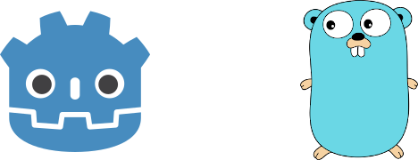

I've been using a lot of [Go](https://golang.org/) in my day to day job. I also have a strong love for open-source software community as almost all the software I depend on comes from the open-source community.

This brings me to introduce my new project [godot-go](https://github.com/godot-go/godot-go); Go bindings for the [Godot](https://godotengine.org/) game engine. I hope I can pull together a community to bring live into the project.

This is the accummulation of almost a year's woth of off-hours tinkering getting [Cgo](https://golang.org/cmd/cgo/) to play nicely with Godot. I'd like to give thanks to an existing [ShadowApex/godot-go](https://github.com/ShadowApex/godot-go/) project for providing inspiration for me to get my project off the ground.

Please download and kick all the tires! I would rather see a flood of issues come in as opposed to nothing. If you have any questions, [join us](https://discord.gg/4JBkykG) in the #gdnative-dev room on Discord and add me (**surgical#3758**) as a friend.

I plan to create a series of blog posts following the development of the project.